# neurodes

**Build, train and inspect neural networks as ComfyUI node graphs.** Typed tensors on the
wires, shape inference while you edit, real training, and an ordinary PyTorch file at the
end.

114 nodes · no new dependencies · 189 automated checks

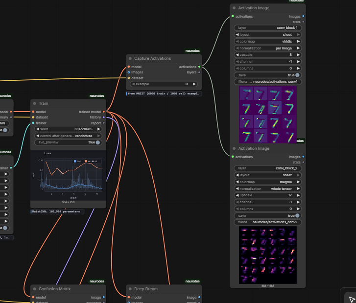

<sub>A convolutional net mid-inspection. **Capture Activations** runs one digit through the
trained model; two **Activation Image** nodes render what the first and second convolutions
saw, on the nodes themselves. Behind them, **Train** draws the loss curve as it goes.</sub>

---

## Contents

- [Why this works](#why-this-works)
- [Install](#install)
- [Your first network](#your-first-network) — a five-minute walkthrough
- [The nodes](#the-nodes)
- [Example workflows](#example-workflows)
- [Training on your own pictures](#training-on-your-own-pictures)
- [What comes out](#what-comes-out)
- [Looking inside a trained network](#looking-inside-a-trained-network)
- [Where the pictures go](#where-the-pictures-go)
- [Things worth knowing](#things-worth-knowing)
- [Troubleshooting](#troubleshooting)
- [Development](#development)

---

## Why this works

ComfyUI is intuitive because of its type system. You cannot plug a VAE into a sampler's
model slot, so the editor teaches you the rules of the thing you are building without ever
explaining them.

The rules of a neural network are exactly that kind of rule. A tensor of one shape goes into
a layer, a tensor of another shape comes out, and much of what makes networks hard to learn
is that this is invisible until it crashes.

So: **the wire carries a tensor, and the node is a layer.** Dropping a Linear onto a wire is
the same act as constructing a module and calling it.

That is not a metaphor invented for this pack. It is the Keras Functional API, which is
already a DAG of typed values:

```python
x = Input(shape=(28, 28, 1))
h = Flatten()(x)
h = Dense(128, activation="relu")(h)
y = Dense(10)(h)
model = Model(inputs=x, outputs=y)
```

Read it vertically and it *is* a ComfyUI workflow. ComfyUI is a better editor for that
program than Python is.

### What is actually on the wire

A **symbolic** tensor: a shape, a dtype, and a back-pointer to the op that made it. Running
the graph *traces* the network rather than executing it, and three things follow.

**Editing stays instant.** Nothing is allocated until you press Build Model.

**Shapes are inferred while you edit.** Every node shows what it produces, on the node.
"What shape is it here?" is the question beginners ask constantly and diagrams never answer.

**Errors land on the node that caused them, before any data exists**, with a sentence you
can act on:

```
Conv 2D: expects a rank-4 tensor shaped [batch, channels, height, width],
but got [B, 784] (rank 2).
Hint: A Conv 2D reads 2 spatial dimension(s). Add a channel dimension with
Unsqueeze if you have one.
```

Shapes carry **names**, not just numbers. `B, T, 512` says the batch and sequence length are
decided at run time, and a mismatch is reported by name. The batch dimension is written out
on purpose — hiding it is where most shape confusion starts.

### The graph compiles to PyTorch

Export gives you the file a practitioner would have written, every forward line annotated
with its shape:

```python
class MnistCNN(nn.Module):
    def __init__(self):
        super().__init__()
        self.conv_block_1 = ConvBlock(1, 16, kernel_size=3, stride=1, norm='batch',
                                      activation='relu', pool=True, groups=1)
        self.linear_1 = nn.Linear(1568, 64, bias=True)
        self.linear_2 = nn.Linear(64, 10, bias=True)

    def forward(self, image):
        conv_block_1 = self.conv_block_1(image)                # [B, 16, 14, 14]
        conv_block_2 = self.conv_block_2(conv_block_1)         # [B, 32, 7, 7]
        flatten_1 = torch.flatten(conv_block_2, start_dim=1)   # [B, 1568]
        linear_1 = self.linear_1(flatten_1)                    # [B, 64]
        relu_1 = F.relu(linear_1)                              # [B, 64]
        linear_2 = self.linear_2(relu_1)                       # [B, 10]
        return linear_2
```

Dragging boxes is a fine way to think and a dead end if the result only runs inside the tool
that drew it. Pair the export with **Save Weights** and the model runs anywhere torch does.

The test suite executes the exported source, loads the trained weights into it, and asserts
both models produce the same numbers — for every layer in the library. The export cannot
quietly stop being the model that ran.

---

## Install

```bash
git clone https://github.com/newsbubbles/ComfyUI_Neurodes ComfyUI/custom_nodes/neurodes
```

Restart ComfyUI. **There is nothing to `pip install`.** torch, numpy and Pillow are already
ComfyUI requirements; charts are drawn with Pillow rather than matplotlib so the pack cannot
fail to load over a plotting library. torchvision is needed only by the MNIST/CIFAR node,
which says so plainly if it is missing.

Requires ComfyUI with the V3 node API (0.3.40+; developed against 0.17.0).

---

## Your first network

Five minutes, no download, and it ends with a picture of what the network learned. Every
node below is found by double-clicking the canvas and typing its name.

**1. Get some data.** Add **Toy Dataset** and set `pattern` to `xor`. It makes a thousand
points in two dimensions, labelled by which diagonal quadrant they fall in.

**2. Declare the input.** Add **Input** and connect the dataset's `input shape` output to
its `shape` slot. The two can now never disagree about what the data looks like. The node
shows `[B, 2]`: a batch of 2-element points, batch size decided at run time.

**3. Add a layer.** Add **Linear**, set `units` to 16, connect the Input's tensor to it. It
shows `[B, 16]` and `48 params`.

**4. Bend the line.** Add **Tanh** after it. *This is the step everything depends on.* Two
Linear layers with nothing between them collapse into a single Linear layer, and no straight
line separates XOR.

**5. Produce an answer.** Add another **Linear** with `units` set to 2 — one score per class.

**6. Close the network.** Add **Build Model** and connect the last tensor to its `output`
slot. Everything upstream becomes one model with real weights. Its `summary` output is the
layer table.

**7. Say how to train.** Add **Trainer**. Set `epochs` to 60 and `learning_rate` to 0.03.
It has no inputs — it is just the recipe, kept separate so one recipe can drive several
models and the comparison stays fair.

**8. Train.** Add **Train** and connect `model`, `dataset` and `trainer`. Run the workflow.

**9. Look at it.** Add **Decision Boundary**, connect the trained model and the dataset.
This asks the network about every point on the plane and colours it by what it would
predict, fading where it is unsure. Add **Plot Loss** on the `history` output too.

Finished, the whole thing is eleven nodes and 82 parameters:

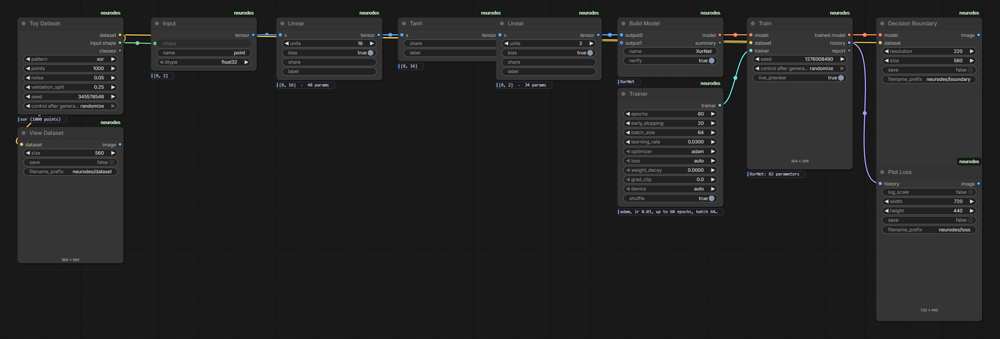

**Now do the experiment.** Delete the Tanh node, reconnect, and run again. Accuracy collapses
to about 50% and the boundary becomes a flat wash. That is the most useful fact about depth
in neural networks, and here it takes fifteen seconds to see rather than a chapter to read.

This is `examples/01-xor-why-activations-matter.json` if you would rather load it.

---

## The nodes

Everything lives under **neurodes/** in the Add Node menu. Node search knows synonyms, so
typing `dense` finds Linear and `deepdream` finds Deep Dream.

### neurodes/shape — describing sizes

| node | what it does |
|---|---|
| **Shape** | A shape as text: `B, 3, 224, 224`. Any rank, and names like `B` for sizes only known at run time. |
| **Shape (Image)** / **(Sequence)** / **(Vector)** | The same thing with dials instead of typing. |
| **Shape From Dims** | Builds a shape out of numbers computed elsewhere in the graph. |
| **Shape Info** | A shape as text, rank and element count. |

Also in this category: **Flatten**, **Reshape**, **Permute**, **Transpose**, **Squeeze**,
**Unsqueeze**, **Concat**, **Stack**, **Slice**, **Reduce** — the plumbing that gets a tensor
into the form the next layer wants.

### neurodes/model — start and finish

**Input** (where data enters) · **Build Model** (closes the graph, allocates the weights) ·
**Model Summary** · **Export PyTorch Code** · **Save Weights** · **Load Weights**

### neurodes/layers — 65 layers

| group | nodes |
|---|---|
| basic | Linear, Embedding, Dropout, Identity |
| norm | Batch Norm, Layer Norm, RMS Norm, Group Norm |
| activations | ReLU, Leaky ReLU, GELU, SiLU, Mish, ELU, SELU, Tanh, Sigmoid, Softmax, Log Softmax, Softplus, Hard Swish, ReLU6, PReLU |
| conv | Conv 1D/2D/3D, Conv Transpose 2D |
| pool | Max/Average Pool 1D/2D, Adaptive Avg Pool 2D, Global Pool, Upsample |
| recurrent | LSTM, GRU, RNN — with Keras-style `return_sequences` instead of torch's tuple |
| attention | Self Attention, Cross Attention, Sinusoidal Positions, Learned Positions |
| blocks | MLP Block, Conv Block, Residual Block, Transformer Block — each with a `repeat` count, so depth is a knob |

Plus **Layer**, one node that can be any single-input layer, chosen from a dropdown. Use it
while exploring, when you want to try five things in the same slot without rewiring.

### neurodes/ops — the operator level

**Add** · **Subtract** · **Multiply** · **Divide** · **Scale** · **Offset** · **Clamp** ·
**Matrix Multiply** · **Einsum** · **Cast**

Add is the residual connection. Multiply is a gate. Einsum is every contraction there is
(`bij,bjk->bik` is a batched matmul; `bhqd,bhkd->bhqk` is attention scores). These are what
let you express an architecture rather than a stack of blocks.

### neurodes/data — something to train on

| node | what it does |
|---|---|
| **Toy Dataset** | Two-dimensional points: moons, spirals, circles, blobs, XOR, checkerboard. No download, trains in seconds, and the only kind whose learned function can be drawn whole. |
| **Curve Dataset** | One number in, one out. Regression. |
| **Image Dataset** | MNIST / FashionMNIST / CIFAR10 / KMNIST. Needs torchvision. |
| **Image Folder Dataset** | **Your own pictures**, one subfolder per class. Pillow only. |
| **Image Pairs From Folders** | Two folders, matched on filename. Before-and-after data for anything image-to-image. |
| **Dataset From Images** | Any ComfyUI IMAGE batch plus labels. |
| **Dataset As Autoencoder** | Throws the labels away and makes each example its own target. |
| **Dataset As Image Task** | Makes the target from the input: denoise, blur, colourise, super resolution, inpaint. **A folder of pictures becomes a supervised problem with no labelling at all.** |
| **Dataset As Diffusion** | Mixes each picture with noise by a random amount and makes *the noise* the answer. This is the training problem behind every diffusion model, and it is still just supervised learning. |
| **Dataset As Pairs** | Draws pairs from a labelled dataset, half matching and half not, and asks *are these the same?* — the problem a Siamese network exists for. Hands them over as two inputs. |
| **Text Dataset** | Text, cut into windows and paired with itself shifted one character along. The training objective of every language model, and it needs no labelling. |
| **Augment Dataset** | Flips, rotations, zoom, shift, brightness, noise. Applies to the training split only, and moves an image pair together so the target still matches. |
| **Dataset Info** | Shapes, class count, example count. Wire its shape into Input. |

### neurodes/train — fit it, then use it

| node | what it does |
|---|---|
| **Trainer** | The recipe: epochs, batch size, learning rate, loss. No inputs, so one recipe can drive several models and the comparison stays fair. |
| **Train** | Runs it. Draws the loss curve on the node as it goes. |
| **Evaluate** | Loss and accuracy on either split. |
| **Forward (Images)** | **One forward pass.** Pictures in, whatever the model makes of them out, as an ordinary IMAGE. No gradients, nothing changes. |
| **Predict (Images)** | The same idea for a classifier: pictures in, class names out. |
| **Sample (Diffusion)** | Starts from pure noise and runs the denoising loop until a picture appears. What a KSampler does, with the same maths and far less engineering. |
| **Generate (Text)** | Lets a trained language model write: ask for the next character, draw one, stick it on the end, ask again. |

**Forward (Images) is the swap that turns a training graph into a tool.** Build the network,
train it once, then take Train out and put Forward in — the same wires, pointed at any image
in your workflow. That is the whole difference between fitting a model and using one, and
here it is one node.

### neurodes/view — charts

**Plot Loss** · **Plot Accuracy** · **Decision Boundary** · **Plot Fit** ·
**Confusion Matrix** · **Reconstructions** · **View Weights** · **View Dataset** ·
**Text Card**

Each draws itself on its own node *and* outputs an IMAGE.

### neurodes/inspect — looking inside

**Capture Activations** · **Activation Image** · **Deep Dream** —
[described below](#looking-inside-a-trained-network).

---

## Example workflows

Everything in `examples/` was **built and run in the editor**, not written by hand, so they
all load and all work. Every number below is from the run of that file, on a CPU; times are
wall-clock for the whole workflow, including loading the data and drawing the charts.

| workflow | what it teaches | result | runs in |
|---|---|---|---|
| `01-xor-why-activations-matter` | Why an activation is not optional. Delete the Tanh and watch it fail. | 82 params, 95.6% | 5s |
| `02-spirals-depth-and-capacity` | Depth against a problem that needs it, with a confusion matrix. | 12,867 params, 97.6% | 7s |
| `03-mnist-convolutional-net` | Real images and convolutions. | 105,914 params, 98.0% | 12s |
| `04-regression-fit-a-curve` | Predicting a number, and seeing the fitted curve over the data. | val loss 0.0009 | 18s |
| `05-transformer-from-primitives` | Embedding → positions → attention → pooling, on a symbolic sequence length. Architecture only. | 1.82M params | 1s |
| `06-siamese-weight-sharing` | **Two inputs, one set of weights.** "Are these two the same?" — the comparison a Siamese network learns instead of the classes. Annotated. | 658 params, 98.7% | 7s |
| `07-inside-a-trained-network` | Trains a CNN, then captures activations, views filters and dreams from the same weights. | 105,914 params, 98.1% | 14s |
| `08-classifier-from-a-folder` | **Train on your own images.** Uses the bundled `examples/sample_images`. | 22,171 params, 93.3% | 18s |
| `09-autoencoder` | Squeeze MNIST through an 8×7×7 bottleneck and rebuild it. No labels used. | 4,649 params, MAE 0.016 | 11s |
| `10-unet-image-to-image` | **A real U-Net**: skip connections, learned upsampling, denoising a folder of pictures. | 14,803 params, MAE 0.021 | 29s |
| `11-diffusion-from-nodes` | **A diffusion model, built and trained from nodes**, then sampled from pure noise. Annotated on the canvas. | 195,651 params | 8 min |
| `12-mlp-the-oldest-idea` | A plain stack of Linear layers on flattened MNIST, and what throwing away the 2-D structure costs. Annotated. | 235,146 params, 94.1% | 7s |
| `13-nano-gpt` | **A language model, from nodes.** Causal attention, per-position loss, and it writes. Annotated. | 629,719 params | 2 min |
| `14-kernels-with-no-teacher` | **No labels, no target, nothing to copy** — one photograph and a statement about what a good filter does. Rediscovers oriented edge detectors. Annotated. | 2,304 params, sparsity 0.62 → 0.55 | 20s |
| `15-what-each-layer-sees` | **A CNN taught one layer at a time, still with no labels**, then asked what each depth wants to see. The receptive-field ladder, built rather than described. Annotated. | 28,560 params | 2.5 min |
| `16-residual-networks` | **The skip connection, with its own control.** Twenty-six convolutions twice over, identical but for one switch. Annotated. | 0.595 vs **0.476** | 10 min |
| `17-vision-transformer` | **An image cut into 64 words** — the patch embedding is a conv whose stride equals its kernel. Beaten by a plain CNN, which is the point. Annotated. | 0.439 vs CNN **0.542** | 15 min |
| `18-depthwise-separable` | **One convolution split in two.** `groups` doing the whole of MobileNet. | **7.9× fewer** weights, 0.593 vs 0.610 | 4 min |
| `19-mixture-of-experts` | **A gate that decides who answers**, with the routing drawn on the plane. Two controls, and a claim that did not survive them. Annotated. | 48 params, 0.662 | 35s |
| `20-inception-parallel-scales` | **Four kernel sizes at once**, glued back together. Fewer weights than the single-scale control *and* better. | **2.8× fewer** weights, 0.572 vs 0.556 | 2 min |

Load one with **Workflow → Open**, or drag the `.json` onto the canvas.

Workflows 16 to 20 are the state-of-the-art shapes, and each ships with the control that
tests its own claim. Three of the five landed somewhere other than the folklore: the vision
transformer **loses** at this data scale and five times the parameters does not help it, the
mixture of experts turns out to buy **stability rather than accuracy**, and
squeeze-and-excitation contributes nothing measurable at all. Those results are in the
canvas notes, next to the numbers that produced them.

### Two inputs, one set of weights

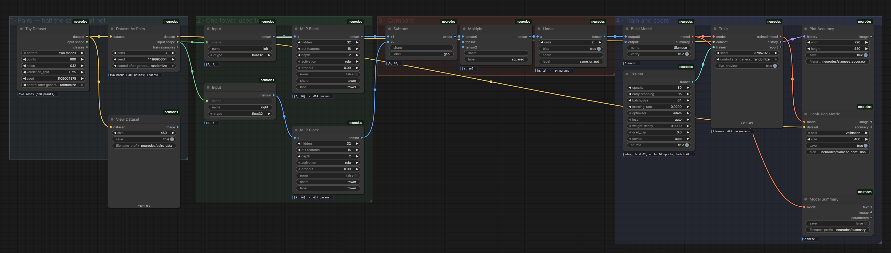

Most models take one thing. Some take two: a pair to compare, a picture plus the timestep
that says how noisy it is, an image plus a mask. **Dataset As Pairs** makes the first kind —
half the pairs share a class and half do not, so 50% is chance and the number means
something — and hands them over as two inputs, so the graph has two Input nodes.

The part worth looking at is that both towers are **one set of weights, used twice**. Forking
a wire duplicates data, not weights, so the two MLP Blocks carry the same `share` tag. Each
node reports `624 params`; the whole model is 658. The summary says so out loud:

```
left_1         Input               [B, 2]        -       -
tower_1        MLP Block           [B, 16]       624     left_1
right_1        Input               [B, 2]        -       -
tower_1        MLP Block (shared)  [B, 16]       -       right_1
gap_1          Subtract            [B, 16]       -       tower_1, tower_1
```

Give them different tags and you get two independent towers that see the world differently,
and the comparison stops meaning anything. That is the whole lesson, and it is one text
field.

### The oldest idea, for comparison

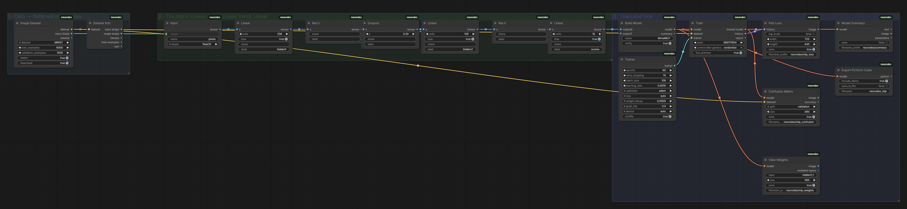

A stack of Linear layers with something bent between them, read left to right: 784 pixels
in, 256, then 128, then 10 scores. `12-mlp-the-oldest-idea` runs it on MNIST with
`flatten` on, so each 28×28 image arrives as 784 numbers in a row and the model has no idea
which of them were neighbours.

It gets most of the way there. But example 03 does the same job on the same 6,000 digits
with a convolution:

| | parameters | accuracy |
|---|---|---|
| the MLP | 235,146 | 94.1% |
| the CNN | 105,914 | 98.1% |

**Less than half the weights, and four points better** — because a convolution is told the
one thing the MLP has to discover from scratch, that nearby pixels belong together. Two
workflows, side by side, and the argument for convolutions stops being something you take
on trust.

### The U-Net, since it is the one with the interesting shape

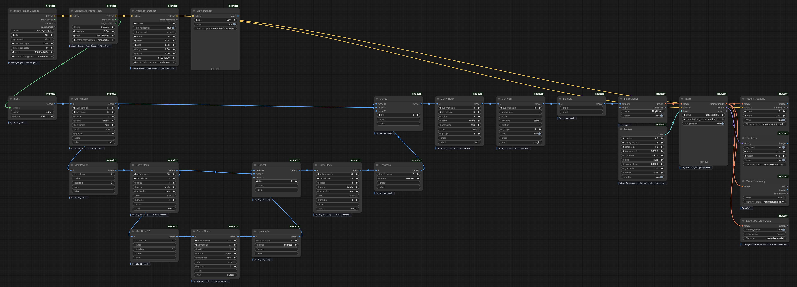

Down, across, up — laid out on the canvas the way it is drawn on paper. Each level is a
resolution, and the two skip connections are the long horizontal wires that leave the
encoder, pass over the whole bottom of the network and arrive at the matching decoder stage.

The bottom of the U, close up, is where the one arithmetic mistake everybody makes lives:

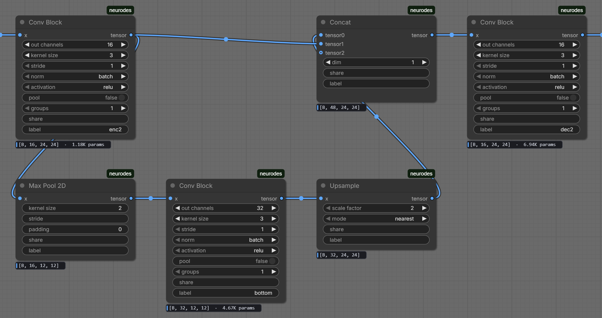

`[B, 32, 24, 24]` coming up from the bottleneck, `[B, 16, 24, 24]` arriving on the skip, and
the Concat announcing `[B, 48, 24, 24]` — worked out and shown on the node while you draw it,
so the next Conv Block cannot be given the wrong number of input channels.

The three data nodes along the top turn a folder of ordinary pictures into a supervised
problem: **Image Folder Dataset** → **Dataset As Image Task** (`denoise`) →
**Augment Dataset**. No labelling, no paired "before" images, no preprocessing script.

Once it has trained, swap **Train** for **Forward (Images)** and the same graph stops being
an experiment and becomes a denoiser you can point at anything in your workflow.

### And then the diffusion model

`11-diffusion-from-nodes` is the same U-Net, given a different job, and it turns into the
thing a KSampler runs. It is annotated on the canvas — grouped by stage, with a note beside
each one explaining what is happening — so it can be read without this file open beside it.

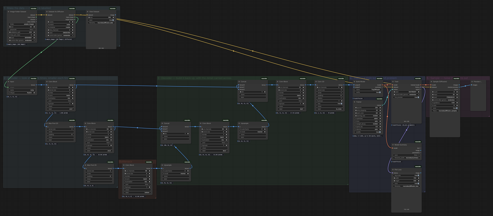

<sub>The five stages, as coloured groups. The notes sit above and below the frame here; on
the canvas they are next to the stage they describe.</sub>

Stripped of engineering, a diffusion model is three sentences:

1. **Mix** a picture with noise, by a random amount `t` between nothing and everything.
2. **Train** a network to look at the mess and say *which part was the noise*.
3. **Sample** by starting from pure noise, asking the network what the noise is, taking a
   little of it away, and going round again.

Step 2 is a plain supervised problem — which is why the same **Train** node that fits a
classifier fits this, with `mse` and no special anything. All the interesting part is step 3,
and step 3 is a for loop.

**Where the timestep goes** is the one thing worth pointing at. The network cannot do its
job without knowing how noisy its input is — the same grey smudge means one thing at
`t=0.1` and another at `t=0.9` — so the timestep travels with the picture as two extra
channels holding a sine/cosine encoding of `t`. The Input node says `[B, 5, 32, 32]`: three
channels of picture, two of clock. Real implementations inject it inside every block; here
it arrives on the wire, where you can see it. Set `time_channels` to 0 and the model, no
longer able to tell how far along it is, produces mud.

The second output of **Sample (Diffusion)** is one frame per step, so a video node turns it
straight into a clip of the picture appearing. Six of those thirty frames:

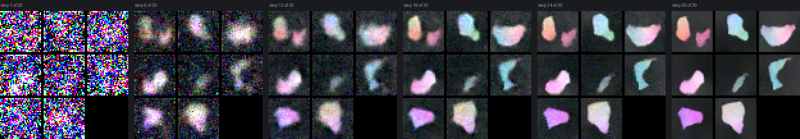

Trained for 164 epochs — about eight minutes on a CPU, early stopping ending it at epoch 164
of 250 and handing back epoch 139. If you only want the idea, set `epochs` to 60 and you have
it in ninety seconds, blurrier.

### And a language model

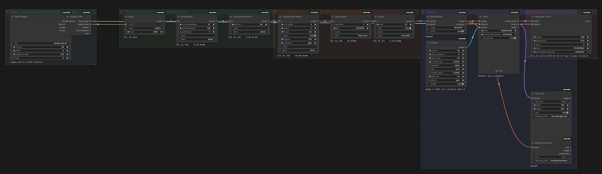

The same shape as GPT-2, three orders of magnitude smaller and reading letters instead of
word pieces. 629,719 parameters, two minutes on a CPU, trained on 55,000 characters — the
prose of this README and these notes. It learns to write, badly, about node graphs:

```
The wire carries worth the the set layer in layer, the and disagrames. Restep
Dresumptortion. The one torch satels the model anything in one timage is are
layer is that step shape ma while its an examples nevery time.

A widget missings nodes the model anyation when model that the stage graph to
inputs the same black Same Trainin so the written anything and constructures
values and is that shape is widget, what laye
```

Two things are worth pointing at.

**The training objective is a shift.** **Text Dataset** cuts the text into overlapping
windows and pairs each one with itself moved a single character to the left. At every
position, the answer is the next character. Nothing is labelled — the text is its own
answer — and the shapes say so: `[B, 96]` in, `[B, 96, 87]` out. One score per character of
the vocabulary, at every one of the 96 positions, and the loss is the mean over all of them.

**`causal` is the whole trick, and turning it off is the best experiment in the pack.**
Attention lets every position see every other position. When the answer at position 5 *is*
the character at position 6, a model that can see position 6 does not predict — it copies.

| | validation accuracy | validation loss | what it writes |
|---|---|---|---|
| `causal` on | 29% | 2.50 | text-shaped English |
| `causal` off | **98%** | **0.07** | a wall of newline characters |

One toggle, a score that looks four times better, and a model that has learned nothing at
all. It is the clearest demonstration of leakage you can build in five minutes, and it is
in the example as a note telling you to try it.

(A detail that fell out of testing this: the leak needs **Learned Positions**. Attention
with no positional signal is permutation-invariant, so it cannot express "attend one to the
right" and cannot find the shortcut even with the mask off. The first version of that test
scored 31% and looked like the leak did not exist.)

### And one with no teacher at all

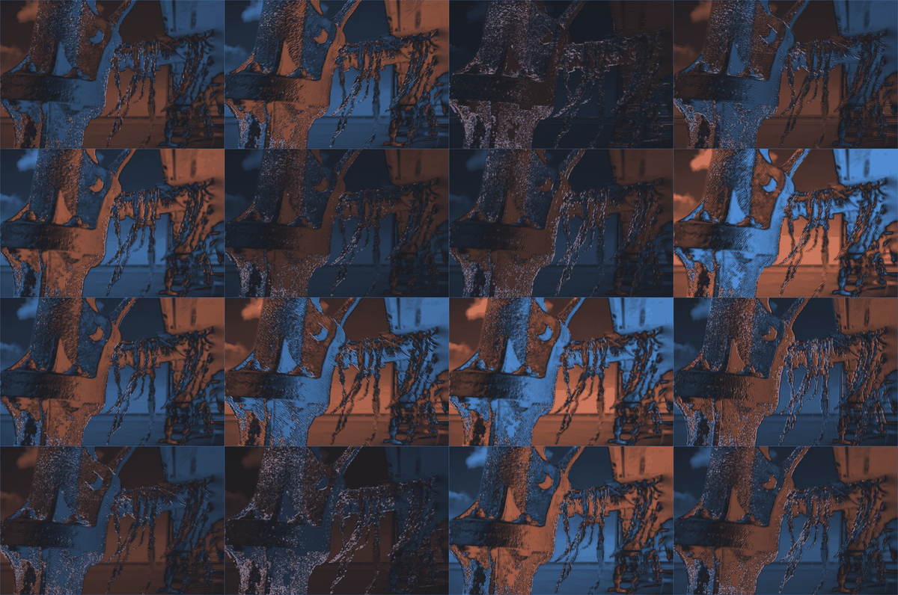

Every other example hands the network the right answer. This one has no answer in it: no
labels, no target picture, nothing to copy. One photograph, and a statement about what a
good filter *does*.

What comes out are oriented edge detectors at a range of angles and scales — the alphabet
that falls out of sparse coding (Olshausen & Field, 1996), out of ICA on natural scenes
(Bell & Sejnowski, 1997), and out of the first layer of essentially any convolutional net
trained on photographs. Nobody wrote the word "edge" anywhere in the graph. Edges are what
is left when you ask for a filter whose response to a photograph is *rarely* large.

The whole model is one `Conv 2D`, 2,304 weights. **Image Patches** cuts six thousand 12×12
squares out of your picture; **Discover Kernels** trains them against an objective instead
of a target; **Filter Bank** slides every learned kernel back over the full-resolution
image. That last part is the point of a convolution and worth saying out loud: a bank
learned on 12×12 patches runs unchanged over a megapixel photograph, and each response
comes out as a plain ComfyUI IMAGE that can go to an upscaler, a ControlNet or img2img like
anything else.

**The obvious objective does not work, and it is in the node so you can watch it fail.**

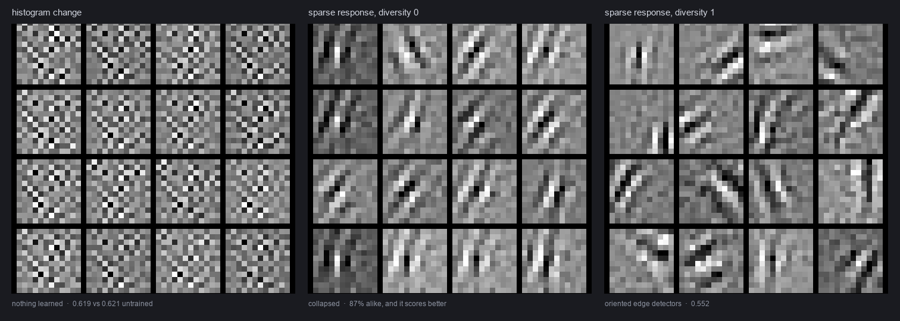

Set `objective` to `histogram change` — make the output histogram as unlike the input's as
possible — and you get sixteen tiles of static. Untrained kernels score 0.621 on that beach
photograph; trained ones score 0.619. Two separate things are wrong:

- **It is not blind to scale.** The score moves if you multiply the response by a constant,
  so the optimiser optimises the constant. On mean-centred patches the cheapest histogram
  maximally unlike a photograph's is a spike at zero, so the bank *switches itself off* — a
  response 26× smaller than the input. Turn `diversity` on and it bolts the other way, to
  75× too large. Either way the thing being trained is the volume knob.
- **`sparse response` is a ratio** — E|r| over the rms — so gain cancels exactly. The only
  way left to move it is to change the *shape* of the distribution, which was the
  interesting part all along.

**And the working objective still needs guidance, for a completely different reason.** Set
`diversity` to 0 and the report says both of these at once:

```
Sparsity improved 0.077 on the untrained floor — each kernel is quiet over
most of the image and loud in a few places, which is what an edge detector does.
The kernels have collapsed: on average each one is 87% the same as its neighbour.
```

The diverse run gained **0.069**. The collapsed one gained **0.077**. By the only measure
being optimised, throwing away fifteen of your sixteen filters is an *improvement* — and of
course it is, because each kernel is scored on its own and sixteen copies of the best answer
are sixteen good answers. No better statistic fixes that, and no amount of staring at the
loss curve reveals it, because the curve really is lower. The middle panel above is what it
looks like: the same diagonal edge, sixteen times.

**One number in the report is there to stop you fooling yourself.** These statistics measure
non-Gaussianity, and photographs are strongly non-Gaussian before any filter touches them.
The same random kernels score 0.798 on Gaussian noise exactly as theory says, 0.62 on a
beach, and 0.52 on a screenshot of text — so an untrained bank on the screenshot posts a
better sparsity than a well-trained one on the beach. Every report therefore re-measures the
floor by re-initialising the model on your own data, and only the gap from it means
anything.

### And then the same trick, three layers deep

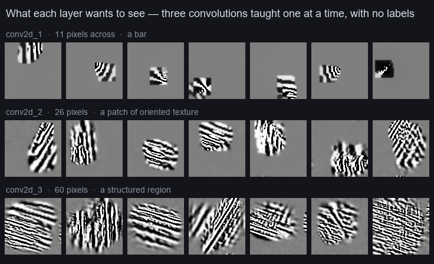

Name a layer on **Discover Kernels** and only that layer trains, judged by its own output.
Chain three of them and you have a convolutional net taught one layer at a time with no
labels anywhere: layer 1 looks at pixels, layer 2 at what layer 1 said, layer 3 at what
layer 2 said. Each is frozen before the next begins — measured drift on the layers below is
exactly 0.00.

Then run the network backwards. Pick a unit, start from noise, push the picture uphill until
that unit is as excited as it can be, and what comes back is a picture of what it is looking
for. The rows above are that, at each depth: **a bar eleven pixels across, then a patch of
oriented texture twenty-six across, then a structured region sixty across.** Nobody designed
that ladder. It is what falls out of stacking one rule three times, and it is the reason
convolutional nets are built deep rather than wide.

**The first row is the argument for nonlinearity.** A single convolution is linear, and
gradient ascent on a linear function has no interior maximum — there is no best input, only
a direction to keep going in, so at the default settings the picture runs to the clamp and
tells you nothing. Put a ReLU in and stack a second convolution and suddenly there is
something to find, because a layer-2 unit responds to a *combination* of layer-1 features
and combinations have best cases. Delete the ReLU nodes and the ladder collapses along with
them, exactly as the algebra says it must.

**Two Deep Dream settings do almost all the work, and the defaults are wrong for this job.**
`objective` is `max`, not `mean`: maximising the mean over a whole feature map asks what
makes a filter fire *everywhere*, and the answer is always the cheapest tileable texture, so
every layer comes back as diagonal hatching and the depth is invisible. `smoothness` is 0.4,
not 0, because ascent otherwise discovers that a one-pixel grating is the cheapest way to
excite an edge detector. Turning `objective` back to `mean` is the most dramatic before-and-
after in the pack.

**Where it stops paying.** Layer 1 improves sparsity 0.265 on its untrained floor, layer 2
improves 0.200, layer 3 improves 0.080 — and by layer 3 the kernels have started repeating
each other (overlap 0.47 against layer 1's 0.31). Three layers is about the end of it at
this size. The famous "layer 3 finds faces" pictures come from far deeper nets with far
larger receptive fields trained on millions of images; sixty pixels buys texture, not
objects, and the example says so.

---

## Training on your own pictures

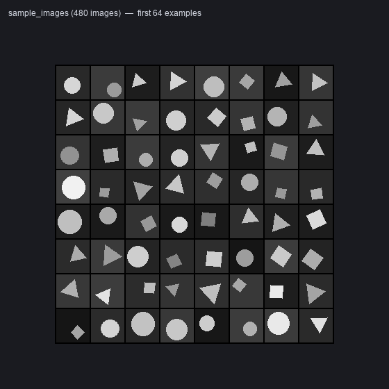

`08-classifier-from-a-folder` runs out of the box against the 480 bundled images above
(`examples/sample_images`, 125 KB, generated with jitter in position, size, rotation, colour
and background so the task is real rather than trivial). To use your own, point
**Image Folder Dataset** at a folder laid out like this:

```
my_photos/
    cat/     img001.png  img002.png  ...
    dog/     img003.jpg  ...
    rabbit/  ...
```

One subfolder per class, named after the class. That is the same layout torchvision's
ImageFolder expects, so datasets downloaded from anywhere usually work unchanged. A relative
path is looked for in ComfyUI's `input/` folder and in this pack's `examples/` folder.

The node signs the folder's contents, so **adding images invalidates the cache** and the
next run picks them up. Without that, dropping in more training data would quietly do
nothing.

### Getting a target without labelling anything

Classification needs a label per image, which means somebody has to sit and sort them.
Image-to-image does not — the answer can be derived from the picture itself.

**Dataset As Image Task** takes any image dataset and makes the target from the input:

| task | the model learns to |
|---|---|
| `denoise` | remove noise (`strength` sets how much) |
| `blur` | sharpen a blurred image |
| `colourise` | put the colour back into a greyscale image |
| `super resolution` | restore detail thrown away by downscaling |
| `inpaint` | fill in a missing rectangle |
| `none` | plain reconstruction — the autoencoder case |

The clean original is the answer, so a folder of holiday photos is already a training set.

**Augment Dataset** multiplies what you have: `copies` says how many augmented versions of
each example to make, and flips, rotation, zoom, shift, brightness and noise say how far to
move them. It touches the **training split only** — augmenting validation data would quietly
make the score meaningless — and when the dataset is an image pair, both images move
together, so the target still lines up with the input.

If you have genuine before-and-after pairs, **Image Pairs From Folders** takes two folders
and matches them on filename stem, so `before/0042.png` pairs with `after/0042.jpg`.

---

## What comes out

From `07-inside-a-trained-network`: a 105,914-parameter CNN trained on MNIST to 98.1% in
under seven seconds on a CPU.

| | |
|---|---|
| 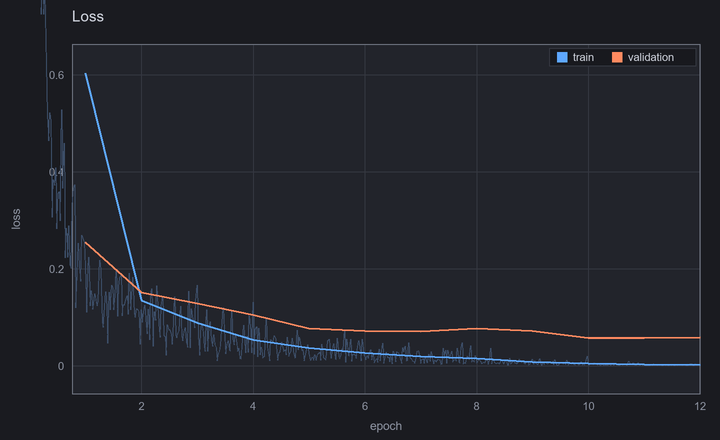 | 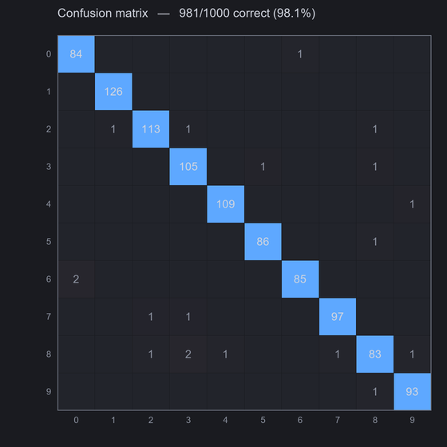 |
| The training curve. Per-epoch train and validation, with the noisy per-batch trace behind them. | Which digits get mistaken for which. The off-diagonal is where the story is. |
| 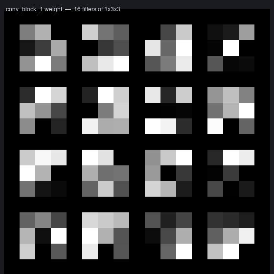 | 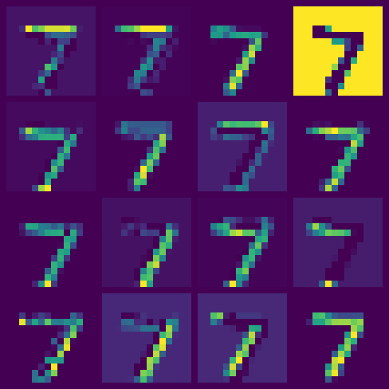 |
| The 16 filters the first convolution learned — edge and blob detectors, arrived at on their own. | The same layer's response to one input: a "7", seen sixteen ways. |
| 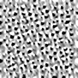 | 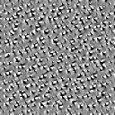 |
| Deep dream from the second convolution: what those weights most want to see, generated from the weights themselves. | The same seed with `feature_size` at 0. Without the gradient blur the optimiser cheats with a one-pixel grating and you get corduroy. |

From `10-unet-image-to-image`, `09-autoencoder` and `08-classifier-from-a-folder`:

| | |
|---|---|
| 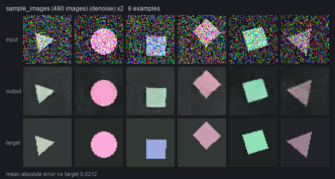 | |
| The U-Net's job, and how well it did it: noisy input, its output, and the clean target it never saw. Mean absolute error 0.021. | |
| 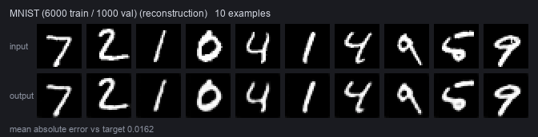 | 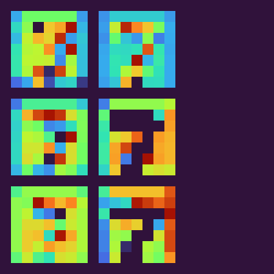 |
| MNIST through an 8×7×7 bottleneck and back. Mean absolute error 0.016, and no labels were used at any point. | The bottleneck itself — the entire compressed code for one digit. |
| 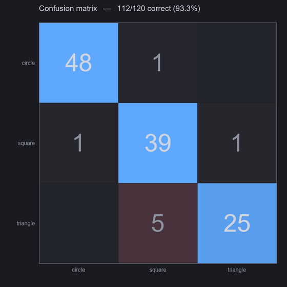 | 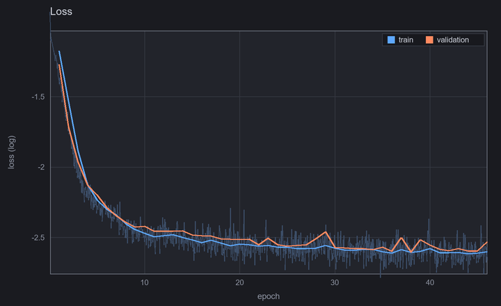 |
| Circles, squares and triangles from a folder of PNGs. | The U-Net's loss on a log scale. Flat from about epoch 20 — which is what early stopping is for. |

And from `11-diffusion-from-nodes`, a 195,651-parameter model that has never been shown
anything but 480 pictures of coloured shapes:

| | |
|---|---|
| 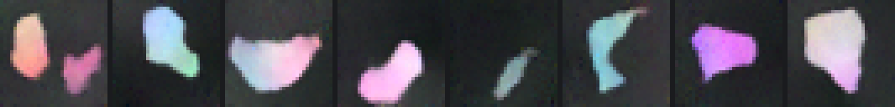 | |
| Eight pictures that did not exist, made out of noise. Not circles and squares — the model is small and the run is short — but unmistakably drawn from the world it was trained on. | |
| 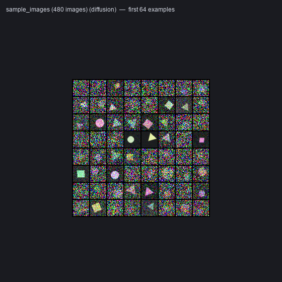 | 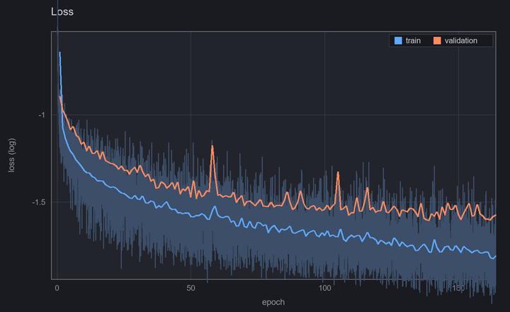 |
| What it is actually shown: the same pictures at every noise level from untouched to obliterated, and never a label. | The loss, log scale. Falls off a cliff and then crawls — and the crawl is where the picture quality is. |
| 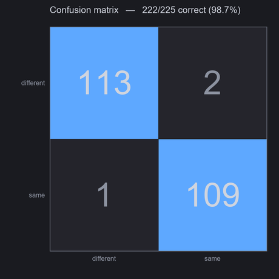 | 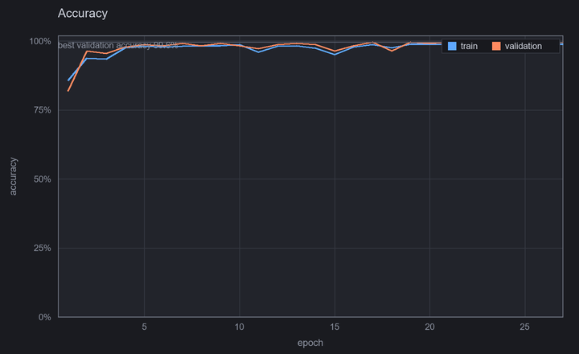 |
| From `06`: same or different, 222 of 225 right, from a 658-parameter comparison it worked out for itself. | The same run's accuracy. Chance is 50% here by construction, so the curve starts where it should. |

---

## Looking inside a trained network

`View Weights` shows what a layer *is*. The inspect nodes show what it *does to a specific
input*, and what it would most like to see.

**Capture Activations** runs one input through and keeps every intermediate tensor. In
ordinary PyTorch that needs a forward hook on every module; here the forward pass already
holds each intermediate in order to feed the next one, so it comes free. Capture once, render
as many layers as you like from the same pass.

**Activation Image** renders one layer with no axes and no labels — the tensor and nothing
else. The important option is **layout**. A conv activation is `[1, 64, 28, 28]`; as a
`sheet` it is one contact sheet you look at, but as a `batch` it is **64 IMAGEs**, and every
node in ComfyUI already knows what to do with a batch. So that one output is also a Video
Combine away from a clip, an upscale away from 64 ControlNet hints, or an img2img away from
something stranger. Eight colormaps, three normalization modes (`per image` makes faint
channels legible, `whole tensor` keeps them honest), nearest-neighbour upscaling so a 7×7 map
is not blurred into looking like more than it is.

**Deep Dream** runs the whole thing backwards. Training changes the weights to suit the data;
this holds the weights still and changes the *picture*, pushing it uphill until the chosen
layer is as excited as it can be. The output is not a diagram of what the network learned, it
is generated from the learned weights themselves. Leave the image input empty to start from
noise (feature visualisation: the pure form of what that layer responds to), or connect one
for classic deep dream.

Two settings do most of the work, and both are exposed so you can watch them fail:

- **`feature_size`** blurs the gradient before applying it. Without it the optimiser
  discovers that the cheapest way to excite an edge detector is a one-pixel grating, and the
  result is uniform corduroy that tells you nothing. Set it to 0 and see.
- **`strength`** is really a contrast dial. The node reports what fraction of the output
  ended up pure black or white; past about 0.02 that goes over 70%.

It runs at resolutions the model never saw — a convolutional prefix does not care about size,
and only the part of the graph the target layer depends on is executed, so it never reaches
the Flatten that would pin it down.

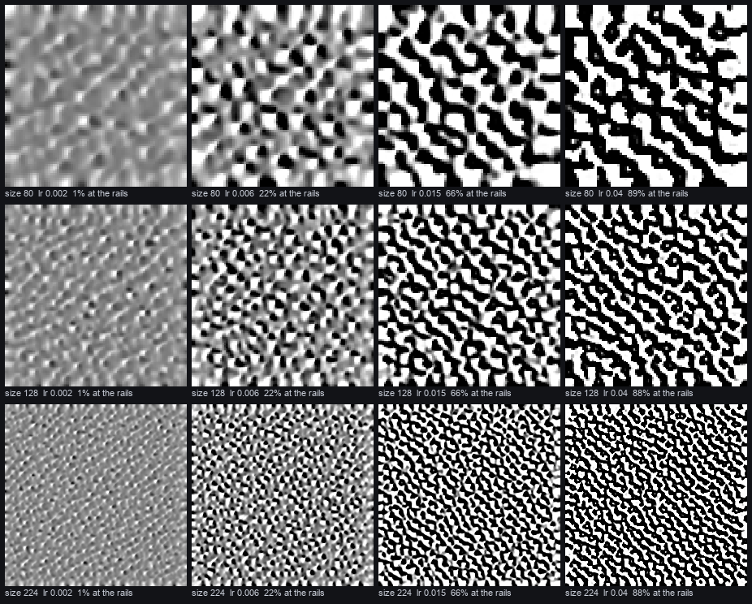

<sub>The same layer at four strengths (left to right) and three canvas sizes (top to bottom),
with the fraction of pixels driven to pure black or white printed on each. Two things fall
out of it. Strength is a contrast dial, and it saturates fast. And **a bigger canvas does not
give bigger features** — their size is set by the layer's receptive field, so a larger canvas
simply fits more of them in.</sub>

---

## Where the pictures go

By default the image nodes **preview** — the picture appears on the node, and the file lives
in `temp/`, which ComfyUI clears. Since in this pack the pictures are usually the thing you
were after, every image node also has a **`save`** toggle. Turn it on and the PNG is written
to:

```
ComfyUI/output/neurodes/<filename_prefix>_00001_.png
```

`filename_prefix` is an advanced widget defaulting to something sensible per node
(`neurodes/loss`, `neurodes/dream`, …). A `/` in it makes a subfolder, as everywhere else in
ComfyUI.

Saved PNGs carry the workflow in their metadata, so **one can be dragged back onto the canvas
to rebuild the graph that produced it**. `Export PyTorch Code` and `Save Weights` write to the
same folder.

---

## Things worth knowing

**Train checks before it trains.** The wrong number of outputs for the number of classes, a
softmax in front of a loss that applies its own, a regression loss on whole-number labels, an
autoencoder whose output shape does not match its target, an Input shape that disagrees with
the data — each is caught and explained before the first step, instead of training a broken
model for ten minutes. It also reads the finished curve and tells you whether it is looking
at overfitting or at a network that never learned anything.

**`epochs` is a ceiling, not a prescription.** Loss plateaus long before the epoch count runs
out, and the extra epochs are not merely wasted — they overfit, so the model you finish with
is worse than one you already passed through. `early_stopping` on the Trainer says how many
epochs to tolerate with no improvement in validation loss, and **the best weights are put
back** when it gives up. Of the eight examples above that train, three stop early and four
more run to the ceiling but hand back earlier weights; the U-Net stops at epoch 46 of 60 and
gives you epoch 38. Set `epochs` generously and let the run decide. `0` turns it off.

Because the weights are restored, the run summary reports the epoch you are *holding* rather
than the last one that happened — otherwise the numbers would describe a model that was
thrown away.

**Weight sharing is a text field.** Forking a wire duplicates data, not weights. Give two
layers the same `share` tag and they use one parameter set. That is a Siamese network.

**A model can take more than one input.** Add a second Input node and give the dataset a
second thing to put in it — a pair to compare, or a timestep. Train feeds them in the order
the Input nodes were traced, and says so by name if the counts do not match.

**Change the seed on Train to train again.** ComfyUI caches node outputs, so re-running with
identical inputs correctly does nothing. The seed widget is the ComfyUI-native way to say
"again, differently".

**Depth is a knob.** Nobody wants to wire twelve transformer layers, so the composite blocks
take a `repeat` count. The primitives are all there if you want to build the block by hand,
and the exported source shows what the block contains either way.

**Linear applies to the last dimension at any rank.** Feeding it `[B, 3, 12, 12]` gives
`[B, 3, 12, 4]`, not an error — that is how every transformer uses it. If you wanted a
classifier, the badge showing the wrong shape is what tells you to Flatten first.

---

## Troubleshooting

**The nodes do not appear after installing.** ComfyUI swallows custom-node import errors into
a log warning. Check the console for `neurodes`. The pack needs a ComfyUI new enough to have
`comfy_api.latest`.

**Training says "element 0 of tensors does not require grad".** You are on an old version of
this pack. Update and restart ComfyUI.

**A workflow I saved earlier loads with the wrong numbers in it.** ComfyUI stores widget
values by position, so if an update adds a widget to a node, every value after it in a
workflow saved beforehand shifts along by one. Nothing errors; the values are just wrong.
Check the node against its defaults and set them again. (`check.py` catches this for the
bundled examples.)

**A shape error I do not understand.** The message names the layer, the shape it got, the
shape it wanted, and a suggested fix. If the hint is wrong or unhelpful, that is a bug worth
reporting — the error messages are treated as a feature here and are tested as one.

**Adding images to my folder changes nothing.** Fixed as of the fingerprinting change; if you
are on an older copy, nudge the `seed` widget to force a reload.

**Deep Dream output is uniform corduroy.** `feature_size` is at 0. Put it back to ~0.9.

**Deep Dream output is pure black and white.** `strength` is too high; try 0.006.

---

## Development

```bash
python check.py
```

189 checks. Most need no ComfyUI at all: shape algebra; every layer's
infer → build → verify → export → execute → numerically-compare round trip; the error
messages, asserting each names its layer and carries a usable hint; graph topology; weight
sharing; training convergence on XOR *including that a network without a hidden layer fails
it*; early stopping keeping the best weights and reporting them honestly; every chart;
activation capture (including that a shared layer's two call sites are captured separately);
the renderer at every tensor rank; and that deep dream raises the activation it targets while
leaving the weights untouched.

Set `COMFYUI_PATH` to also validate the node schemas, that every image node can save, and
that the example workflows reference only nodes that exist and still line up with those
nodes' widgets.

### Layout

```
neurodes/core/     pure Python + torch, imports nothing from ComfyUI
neurodes/nodes/    thin ComfyUI adapters over it
web/               the frontend extension: shape badges and link colours
examples/          workflows, the bundled sample images, and the gallery
notes/             design.md, research.md, build-log.md
```

Every layer is declared **once**, in `neurodes/core/registry.py`, with its shape inference,
its `nn.Module`, its source-emitting form and its widget list. The discrete nodes, the `Layer`
dropdown, the exporter and the summary table are all generated from that one table, so the
shape a node shows you and the module that gets built cannot drift apart.

Adding a layer is one registry entry and no node code.

`notes/` is the working record: `design.md` for why the architecture is what it is,
`research.md` for what the ComfyUI V3 API actually does (read out of the source), and
`build-log.md` for the bugs and the reasons behind decisions that would otherwise be lost.

## Licence

MIT.
